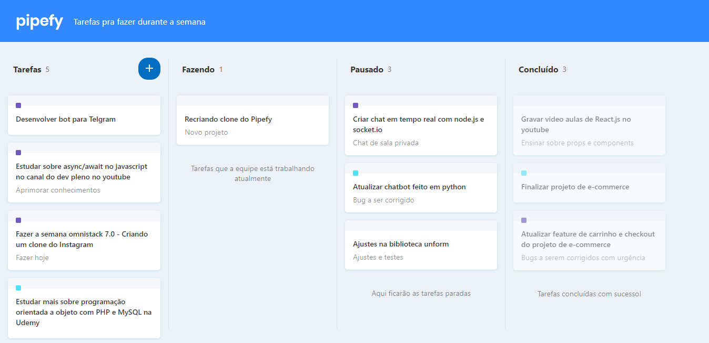

  

  

  
  
  

  

  

 

  Clone da interface do pipefy

  

## Tech

- React.js

> Clone da interface do pipefy.

## Development setup

### Front-End

- Rode o comando `yarn install` na pasta do projeto;
- Rode o comando `yarn start`;

### Como contribuir

- Dê um Fork neste repositório;
- Crie uma branch para a nova funcionalidade: `git checkout -b nova-funcionalidade`;
- Faça um commit na sua branch: `git commit -m 'feat: My feature'`;
- Dê um push da sua branch: `git push origin my-feature`;

Depois de concluir estes passos crie uma nova pull request e pronto!.

# License

[MIT License](/LICENSE)
